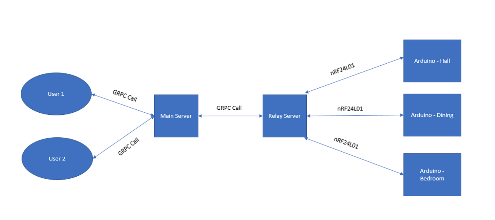

Home Automation
===========
This project can be used to automate electrical appliances in a house letting them be controlled through the phone.

The main objective of this project is to develop a home automation system using an Arduino board, raspberry pi using NRF24L01 transceiver module for communication.
There are 4 major components in the system:
1. Android Application
2. Main Server
3. Relay Server
4. Arduino

In order to achieve this, the main sever module is interfaced to a relay server (running on Raspberry Pi) which in turn is interfaced with different Arduino boards on the receiver end. Based on the user selection, an android application on the cell phone sends ON/OFF commands to the main server which in turn makes an RPC call and forwards the data to the relay server. The relay server parses the request and sends the request to the appropriate Arduino. The Arduino which is connected to different appliances via Relay module turns the appliance ON/OFF. Whenever a user makes some update, the main server takes care of updating all the other users connected to the main server as well Grpc has been used for communication across different components in the system, and NRF24L01
for communication with the Arduino.